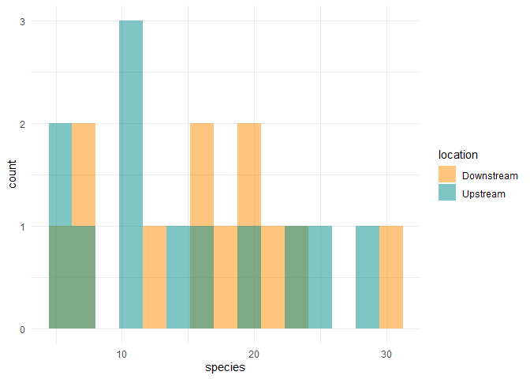
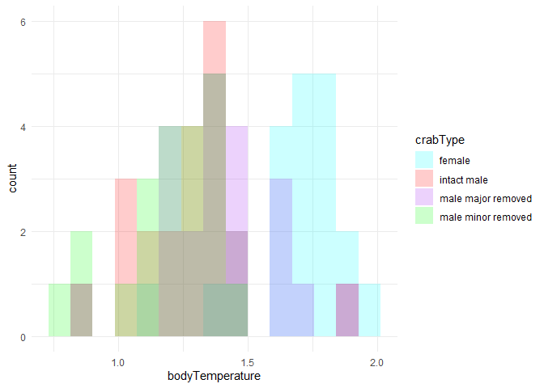

Lab 6 Comparing means
================
Connor Hayes
2021-04-29

Fill out this report and submit it as your completed assignment.

You can view the R markdown script that created this report here:
[README.Rmd](README.Rmd)

## *t*-test

Researchers studying the number of electric fish species living in
various parts of the Amazon basin were interested in whether the
presence of tributaries affected the local number of electric fish
species in the main rivers (Fernandes et al. 2004).

They counted the number of electric fish species above and below the
entrance point of a major tributary at 12 different river locations.

The data is provided in your GitHub repository.

For each question below, write a sentence answering the question and
show the code you used to come up with the answer, if applicable.

### Question A

> Test the hypothesis that the tributaries have no effect on the number
> of species of electric fish.

``` r
library(tidyverse)
```

    ## -- Attaching packages --------------------------------------- tidyverse 1.3.0 --

    ## v ggplot2 3.3.3     v purrr   0.3.4
    ## v tibble  3.0.4     v dplyr   1.0.2
    ## v tidyr   1.1.2     v stringr 1.4.0
    ## v readr   1.4.0     v forcats 0.5.0

    ## -- Conflicts ------------------------------------------ tidyverse_conflicts() --
    ## x dplyr::filter() masks stats::filter()
    ## x dplyr::lag()    masks stats::lag()

``` r
electric_fish <-read.csv(file = "chap12q19ElectricFish.csv")

fish_streams <-
  pivot_longer(electric_fish, speciesUpstream:speciesDownstream,
               names_to = "location",
               values_to = "species") %>%
            mutate(location = str_remove(location, c("species"))) %>%
  print()
```

    ## # A tibble: 24 x 3
    ##    tributary location   species
    ##    <chr>     <chr>        <int>
    ##  1 Içá     Upstream        14
    ##  2 Içá     Downstream      19
    ##  3 Jutaí     Upstream        11
    ##  4 Jutaí     Downstream      18
    ##  5 Japurá   Upstream         8
    ##  6 Japurá   Downstream       8
    ##  7 Coari     Upstream         5
    ##  8 Coari     Downstream       7
    ##  9 Purus     Upstream        10
    ## 10 Purus     Downstream      16
    ## # ... with 14 more rows

We see that there are slight differences between both upstream and
downstream total species in each tributary.

### Question B

> What is the difference in the mean numbers of species between areas
> upstream and downstream of a tributary? What is the 95% confidence
> interval of this difference in means?

``` r
fish_summarized <-
  fish_streams %>%
  group_by(location) %>%
  summarize(
    n= n(),
    mean = mean(species),
    sd = sd(species),
    sem = sd/sqrt(n),
    upper = mean + 1.96 * sem,
    lower = mean - 1.96 * sem
    
  ) %>%
  print()
```

    ## `summarise()` ungrouping output (override with `.groups` argument)

    ## # A tibble: 2 x 7
    ##   location       n  mean    sd   sem upper lower
    ##   <chr>      <int> <dbl> <dbl> <dbl> <dbl> <dbl>
    ## 1 Downstream    12  16.4  7.22  2.08  20.5  12.3
    ## 2 Upstream      12  14.6  7.93  2.29  19.1  10.1

Our difference between means is 1.8334. The 95% confidence interval is
-4.59 to 8.53

### Question C

> State the assumptions that you had to make to complete parts (A) and
> (B). Create a graph to assess whether one of those assumptions was
> met.

``` r
fish_streams %>% 
  ggplot(aes(x = species)) +
  geom_histogram(
    aes(fill = location), 
    bins = 15, 
    alpha = 0.5, 
    position = "identity"
  ) +
  scale_fill_manual(values = c("darkorange","cyan4")) +
  theme_minimal()
```

<!-- -->

Normal distribution, and a random sample

## ANOVA

Fiddler crabs are so called because males have a greatly enlarged
“major” claw, which is used to attract females and to defend a burrow.

Darnell and Munguia (2011) recently suggested that this appendage might
also act as a heat sink, keeping males cooler while out of the burrow on
hot days.

To test this, they placed four groups of crabs into separate plastic
cups and supplied a source of radiant heat (60-watt light bulb) from
above. The four groups were intact male crabs, male crabs with the major
claw removed; male crabs with the other (minor) claw removed (control);
and intact female fiddler crabs.

They measured the body temperature of crabs every 10 minutes for 1.5
hours. These measurements were used to calculate a rate of heat gain for
every individual crab in degrees C/log minute. Rates of heat gain for
all crabs are provided in the accompanying data file.

### Question D

> Graph the distribution of body temperatures for each crab type:

``` r
crab_temperatures <- read_csv(file = "chap15q27FiddlerCrabFans.csv")
```

    ## 
    ## -- Column specification --------------------------------------------------------
    ## cols(
    ##   crabType = col_character(),
    ##   bodyTemperature = col_double()
    ## )

``` r
cols(
  crabType = col_character(),
  bodyTemperature = col_double()
  
)
```

    ## cols(
    ##   crabType = col_character(),
    ##   bodyTemperature = col_double()
    ## )

``` r
View(crab_temperatures)


crab_temperatures %>%
  ggplot(aes(x = bodyTemperature)) + 
  geom_histogram(
    aes(fill = crabType), 
    bins = 15, 
    alpha = 0.2, 
    position = "identity",
    na.rm = TRUE
  ) + 
  scale_fill_manual(values = c("cyan", "red", "purple", "green")) +
  theme_minimal()
```

<!-- -->


    ### Question E

    > Does body temperature vary among crab types? State the null and alternative hypothesis, conduct and ANOVA, and interpret the results.


    ```r
    aov(bodyTemperature ~ crabType, data = crab_temperatures)

    ## Call:
    ##    aov(formula = bodyTemperature ~ crabType, data = crab_temperatures)
    ## 
    ## Terms:
    ##                 crabType Residuals
    ## Sum of Squares  2.641310  3.467619
    ## Deg. of Freedom        3        80
    ## 
    ## Residual standard error: 0.2081952
    ## Estimated effects may be unbalanced
    ## 1 observation deleted due to missingness

What we see is an extremely low P value, thus what we can do is reject
the null hypothesis. Therefore, there is a difference between crab types
and body temperatures.
